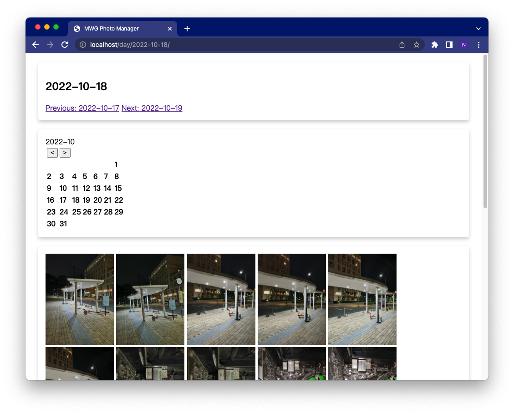

# MWG Photo Manager

Cross-platform photo manager with unified indexing (that means create indexing for once, you can browse your photos on any other platforms or other devices). The indexing uses relative path, don't worrry if you move photos to new devices!

The project is based on python. Configure your virtual environments, then enjoy using it.

## Using Scenario

1. I am using MacOS, but I would like to open my album on Windows with `zero cost`. (no re-indexing, sync all my favorates, etc)

2. My album is on a portable drive, I would like to browse my photos using other devices with `zero cost`.

3. I would like to move my albums to another place with `zero cost`.


## Setup

### Place this project to proper place

You need to place all your photos in a directory, say `Photos`. Then you put this directory in `Photos` as well. i.e.

-Photos
    -photomgt
    -xxxx.jpg
    -xxxx.jpg
    -folder1
        -xxxxx.jpg
        -xxxxx.jpg
    
### Configure Virtual Enviroments

For each OS, you just need to configure this once.

```bash
pip install virtualenv
mkdir envs
cd envs
virtualenv mac
cd ..
./envs/mac/bin/python -m pip install -r requirements.txt
```

### Start Server

```bash
./envs/mac/bin/python manage.py runserver
```

### Create Index

Only need to run this once (if no new photos added)

http://127.0.0.1:8001/index_all/


## After setup

### Start Server

```bash
./envs/mac/bin/python manage.py runserver
```

### Usage

http://127.0.0.1:8001/


## Demo

