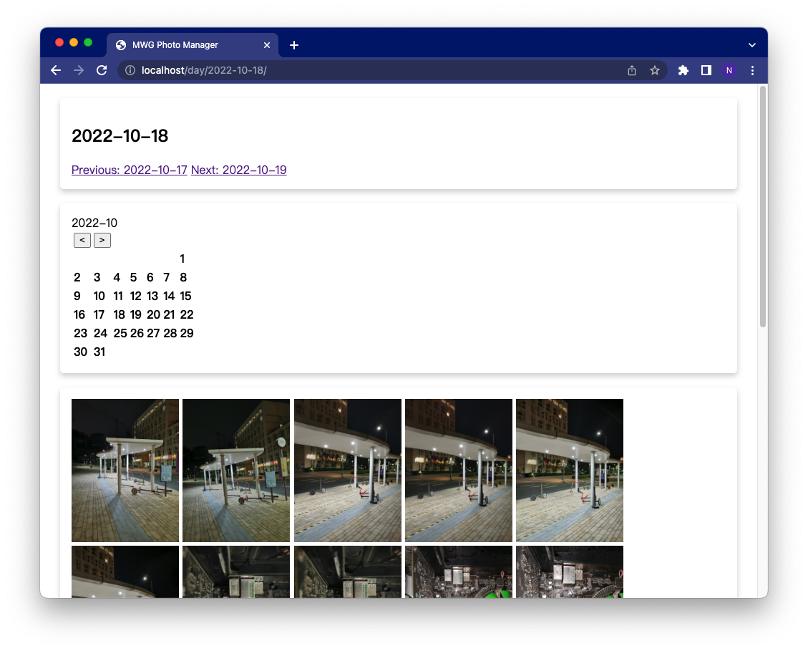

# MWG Photo Manager

Cross-platform photo manager with unified indexing (that means create indexing for once, you can browse your photos on any other platforms or other devices). The indexing uses relative path, don't worrry if you move photos to new devices!

The project is based on python. Configure your virtual environments, then enjoy using it.

<br/>
<br/>
<br/>

## Using Scenario

1. I am using MacOS, but I would like to open my album on Windows with `zero cost`. (no re-indexing, sync all my favorates, etc)

2. My album is on a portable drive, I would like to browse my photos using other devices with `zero cost`.

3. I would like to move my albums to another place with `zero cost`.

<br/>
<br/>
<br/>

## Setup


### Clone this project

```bash
git clone https://github.com/bokesyo/photomgt.git
```

### Move this project to your photo directory

You need to place all your photos in a directory, say `Photos`. Then please move this directory to `Photos` as well.

```bash
mv -r photomgt /Users/xxxx/Photos
```

### Configure virtual enviroments

For each OS, you just need to configure this once. Firstly you need to install python3. Then use pip to install dependencies.


```bash
cd /Users/xxxx/Photos/photomgt
pip install -r requirements.txt
```


<br/>
<br/>
<br/>

## Usage

### Start server

```bash
python manage.py runserver 0.0.0.0:80
```

### Create Index

Open `http://localhost/` and follow the guidance.

Only need to run this once (if no new photos added)


### Enjoy your photos

Open `http://localhost/` and follow the guidance.


<br/>
<br/>
<br/>


## Demo

